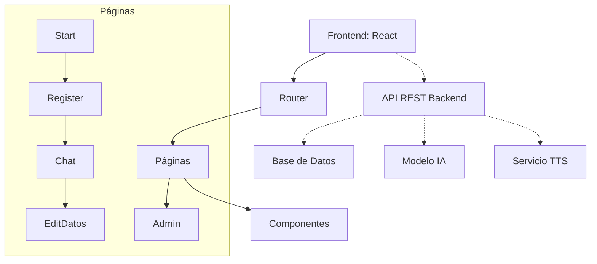

# 🧠 PsicoVirtualAI

<div align="center">
  
  
  
  ### Acompañamiento Psicológico Virtual potenciado por IA
  
  [](https://reactjs.org/)
  [](https://tailwindcss.com/)
  [](https://github.com/yourusername/psicovirtualai)
  [](LICENSE)
  
</div>

## 📋 Contenido

- [✨ Características](#-características)
- [🔍 Vista Previa](#-vista-previa)
- [🏗️ Arquitectura](#️-arquitectura)
- [🚀 Instalación](#-instalación)
- [🛠️ Uso](#️-uso)
- [👥 Equipo](#-equipo)
- [🤝 Contribución](#-contribución)
- [📝 Licencia](#-licencia)

## ✨ Características

### Para Usuarios
- **🔐 Registro inteligente multietapa** - Formulario intuitivo de datos demográficos, vivienda, educación, situación laboral y salud
- **💬 Chatbot psicológico avanzado** - Asistente IA especializado en apoyo emocional y escucha activa
- **📊 Tests psicológicos interactivos** - Evaluaciones estructuradas (GHQ-12, DEPS, ANS, etc.) con análisis automático
- **🔊 Interfaz conversacional por voz** - Respuestas por texto a voz para mayor accesibilidad
- **📱 Diseño adaptable** - Experiencia óptima en dispositivos móviles y de escritorio
- **📜 Historial completo** - Acceso y gestión de conversaciones anteriores

### Para Administradores
- **🔍 Panel de control** - Búsqueda y monitoreo de usuarios registrados
- **👁️ Consulta detallada** - Visualización completa de información de usuarios
- **🔒 Acceso seguro** - Sistema de permisos basado en roles

## 🔍 Vista Previa

<div align="center">
  
  
</div>

<details>
<summary>Ver más capturas</summary>
<div align="center">
  
  
  
</div>
</details>

## 🏗️ Arquitectura



### Tecnologías Utilizadas

| Frontend | Backend | Desarrollo |
|----------|---------|------------|
| React | API REST | Vite |
| React Router DOM v6 | Endpoints personalizados | ESLint |
| Axios | Modelo de IA | Git |
| js-cookie | API de texto a voz | npm/yarn |
| Tailwind CSS | | PostCSS |
| Lucide Icons | | |

### Estructura de Carpetas

```
📦 Frontend
 ┣ 📂 public
 ┃ ┣ 📜 BotIcon.png
 ┃ ┣ 📜 FlechaDerecha.png
 ┃ ┣ 📜 FlechaIzquierda.png
 ┃ ┣ 📜 NuevoChat.png
 ┃ ┣ 📜 NuevoChatAzul.png
 ┃ ┣ 📜 iconEnviar.png
 ┃ ┗ 📜 basura.png
 ┣ 📂 src
 ┃ ┣ 📂 components
 ┃ ┃ ┣ 📜 Css.css
 ┃ ┃ ┣ 📜 ChatContainer.jsx
 ┃ ┃ ┣ 📜 MsgIA.jsx
 ┃ ┃ ┣ 📜 MsgUser.jsx
 ┃ ┃ ┗ 📜 Prompts.jsx
 ┃ ┣ 📂 pages
 ┃ ┃ ┣ 📜 Admin.jsx
 ┃ ┃ ┣ 📜 Chat.jsx
 ┃ ┃ ┣ 📜 EditDatos.jsx
 ┃ ┃ ┣ 📜 Register.jsx
 ┃ ┃ ┗ 📜 Start.jsx
 ┃ ┣ 📂 routes
 ┃ ┃ ┗ 📜 AppRouter.jsx
 ┃ ┣ 📜 App.jsx
 ┃ ┣ 📜 main.jsx
 ┃ ┗ 📜 index.css
 ┣ 📜 .env
 ┣ 📜 .gitignore
 ┣ 📜 eslint.config.js
 ┣ 📜 index.html
 ┣ 📜 package-lock.json
 ┣ 📜 package.json
 ┣ 📜 postcss.config.js
 ┣ 📜 tailwind.config.js
 ┗ 📜 vite.config.js
```

## 🚀 Instalación

### Prerrequisitos

- Node.js (v16.0.0 o superior)
- npm o yarn
- Backend configurado y funcionando

### Pasos de instalación

1. **Clonar el repositorio**

```bash
git clone https://github.com/yourusername/psicovirtualai.git
cd psicovirtualai
```

2. **Instalar dependencias**

```bash
npm install
# o con yarn
yarn install
```

3. **Configurar variables de entorno**

Crea un archivo `.env` en la raíz del proyecto:

```env
VITE_URL=http://localhost:5000
# Otras variables si son necesarias
```

4. **Iniciar en modo desarrollo**

```bash
npm run dev
# o con yarn
yarn dev
```

🌐 La aplicación estará disponible en [http://localhost:5173](http://localhost:5173)

## 🛠️ Uso

### Flujos de Usuario

#### 👤 Usuario Regular

1. **Registro**: Completa el formulario multietapa con tus datos personales
2. **Iniciar sesión**: Accede con tus credenciales
3. **Chat**: Interactúa con el asistente virtual para obtener apoyo psicológico
4. **Tests**: Realiza evaluaciones psicológicas guiadas por el asistente
5. **Gestión de datos**: Actualiza tu información personal cuando sea necesario

#### 👑 Administrador

1. **Acceso al panel**: Ingresa con credenciales de administrador
2. **Búsqueda de usuarios**: Localiza usuarios por ID, correo o documento
3. **Consulta de datos**: Visualiza información detallada de los usuarios

### Comandos Disponibles

```bash
# Desarrollo con recarga en caliente
npm run dev

# Compilar para producción
npm run build

# Vista previa de la versión de producción
npm run preview

# Ejecutar linter
npm run lint
```

## 👥 Equipo

Desarrollado con ❤️ por el grupo **Valle del Software** de la **Universitaria de Colombia**

<div align="center">
  <table>
    <tr>
      <td align="center"><a href="#"><br><sub><b>Nombre Dev 1</b></sub></a></td>
      <td align="center"><a href="#"><br><sub><b>Nombre Dev 2</b></sub></a></td>
      <td align="center"><a href="#"><br><sub><b>Nombre Dev 3</b></sub></a></td>
    </tr>
  </table>
</div>

## 🤝 Contribución

¡Nos encantaría recibir tu ayuda para mejorar PsicoVirtualAI! Para contribuir:

1. Haz fork del repositorio
2. Crea una rama para tu función: `git checkout -b feature/nueva-funcion`
3. Realiza tus cambios y haz commit: `git commit -m 'Añadir nueva función'`
4. Sube tus cambios: `git push origin feature/nueva-funcion`
5. Envía un Pull Request

Por favor, asegúrate de seguir nuestras [pautas de contribución](CONTRIBUTING.md) y el [código de conducta](CODE_OF_CONDUCT.md).

## 📝 Licencia

Este proyecto está bajo la Licencia MIT - consulta el archivo [LICENSE](LICENSE) para más detalles.

---

<div align="center">
  <p>
    <a href="https://github.com/yourusername/psicovirtualai/issues">Reportar un problema</a> •
    <a href="https://github.com/yourusername/psicovirtualai/discussions">Discusiones</a> •
    <a href="mailto:contacto@ejemplo.com">Contacto</a>
  </p>
  
  <p>© 2025 Valle del Software - Universitaria de Colombia</p>
</div>